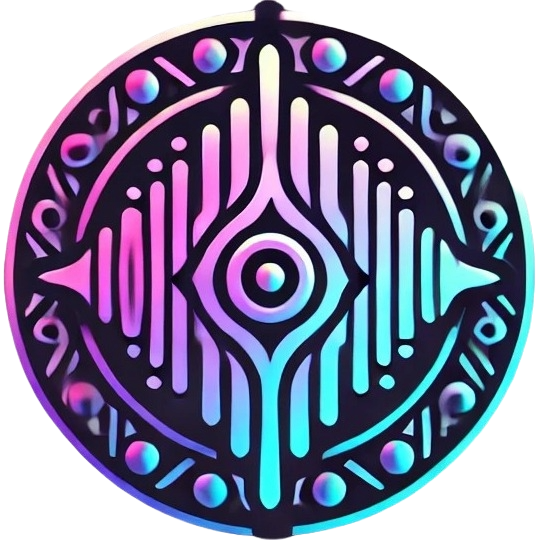

<p align="center">
  
</p>

<h1 align="center">SoundTribe - Microservicio de Usuarios</h1>
<p align="center">
  
  
  
  
  <br>
  <i>Conectando personas a través del sonido</i>
</p>

## 📌 Índice
- [¿Qué es SoundTribe?](#-qué-es-soundtribe)
- [Funcionalidades](#-funcionalidades)
- [Tecnologías](#-tecnologías)
- [Imagen Docker](#-imagen-docker)
- [Documentación API](#-documentación-api)
- [Roadmap](#-roadmap)
- [Contribuciones](#-contribuciones)
- [Licencia](#-licencia)

## 🎵 ¿Qué es SoundTribe?

**SoundTribe** es una plataforma de música social que nace como un proyecto personal para conectar a las personas a través de su pasión por la música. Este repositorio contiene el **microservicio de usuarios**, un componente crucial de la arquitectura completa de SoundTribe.

> 💡 **Visión:** Crear comunidades vibrantes alrededor de la música, permitiendo a cualquier persona compartir sus gustos musicales, descubrir nuevos artistas y conectar con personas afines.

Este microservicio representa mi compromiso con el aprendizaje continuo y mi pasión por crear tecnología que acerque a las personas.

## ✨ Funcionalidades

Este microservicio gestiona todo lo relacionado con los usuarios:

- **Registro y autenticación:**
  - Sistema completo de registro con validaciones
  - Login seguro con JWT
  - Refresh tokens

- **Gestión de perfiles:**
  - Carga y gestión de imágenes de perfil (integración con MinIO)
  - Generación y validación de slugs únicos
  - Edición de datos de perfil

- **Seguridad:**
  - Implementación robusta con Spring Security
  - Filtros personalizados
  - Encriptación de contraseñas

## 🛠️ Tecnologías

<p align="center">
  
  
  
  
  
  
  
  
  
</p>

## 🐳 Imagen Docker

El microservicio está disponible como imagen Docker en Docker Hub:

[](https://hub.docker.com/r/garbi21/soundtribe-users-api)

Para usar la imagen:

```bash
docker pull garbi21/soundtribe-users-api
```

También puedes incluirla directamente en tu docker-compose.yml:

```yaml
services:
  users-api:
    image: garbi21/soundtribe-users-api:latest
    ports:
      - "8080:8080"
    environment:
      - SPRING_PROFILES_ACTIVE=prod
      # Otras variables de entorno según necesites
```


## 📚 Documentación API

La documentación completa de la API está disponible a través de Swagger UI cuando el proyecto está en ejecución:

```
http://localhost:8080/swagger-ui.html
```


## 🗺️ Roadmap

- [x] Implementación de roles y permisos
- [ ] Sistema de recuperación de contraseñas


## 👥 Contribuciones

¿Quieres contribuir a SoundTribe? ¡Genial! Toda contribución es bienvenida. Sigue estos pasos:

1. Haz un fork del proyecto
2. Crea tu rama de características (`git checkout -b feature/los-mejores-cambios-panchito`)
3. Realiza tus cambios y haz commit (`git commit -m 'Add los cambios mas geniales de la vida'`)
4. Sube los cambios (`git push origin feature/los-mejores-cambios-panchito`)
5. Abre un Pull Request

## 📄 Licencia

Este proyecto está bajo la Licencia MIT - ver el archivo [LICENSE](LICENSE) para más detalles.

---

<p align="center">
  Hecho con ❤️ por <a href="https://github.com/Garbi-Collector">Garbi-Collector</a>
</p>
